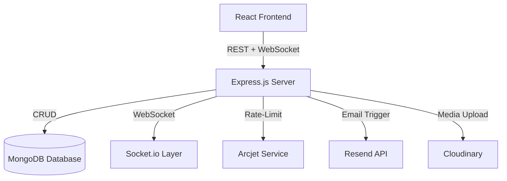
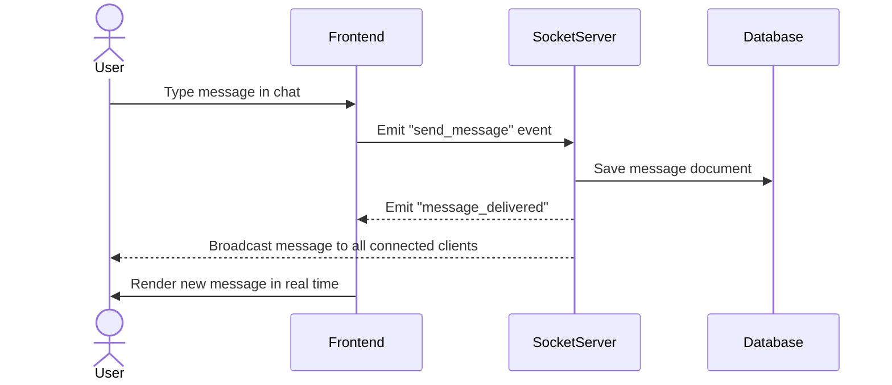
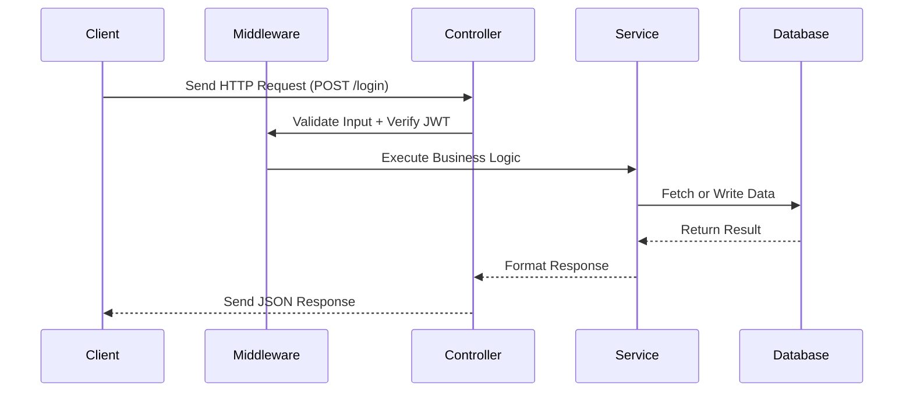
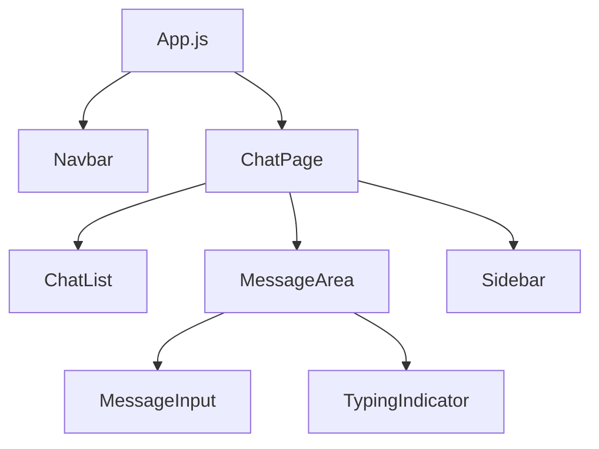
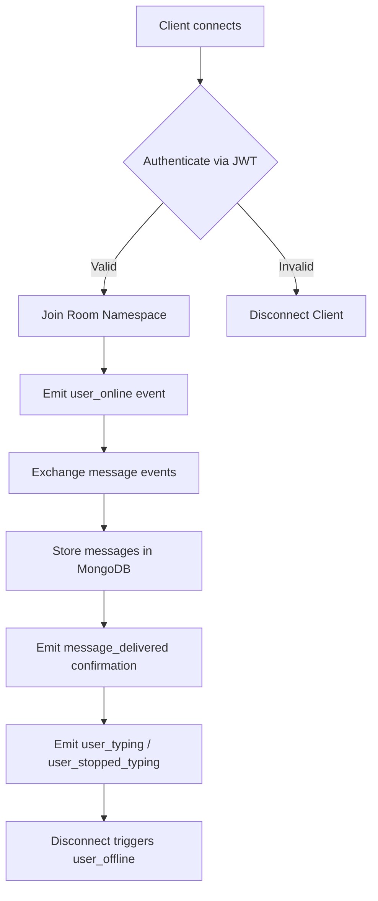
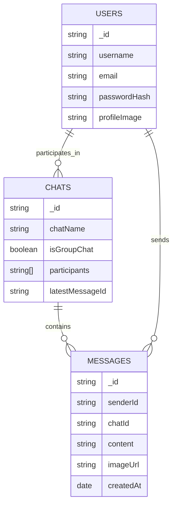
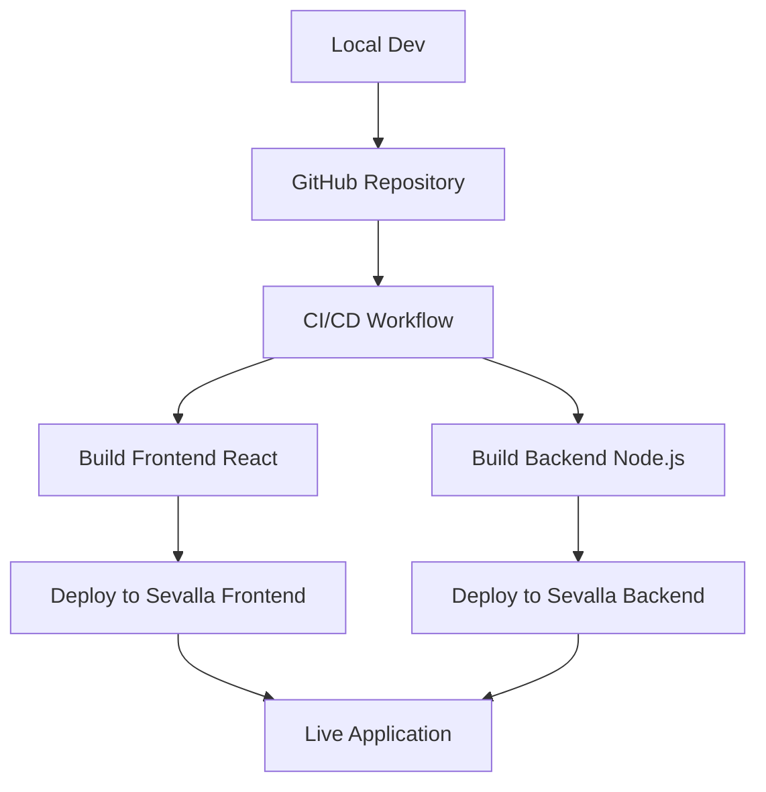

# Welcome to Chatify
This project aims to create a beautiful web interface for real-time web chatting.
The motivation behind working on this project was:
- getting familiar with MERN 
- learning to integrate web-sockets and convert the web-application from a static app to a dynamic one, in which users can interact concurrently with each other having sub-millisecond delays in message transmission.

# Chatify — Real-Time Chat Application

**Chatify** is a full-stack real-time chat application built with the **MERN stack** (MongoDB, Express.js, React, Node.js) featuring live messaging via WebSockets, JWT authentication, image uploads, rate-limiting, and automated transactional emails.  
This project emphasizes scalability, real-time communication, and clean UI/UX design — deployed successfully on **Sevalla**.

---

## Overview

Chatify enables real-time messaging between users with features like online/offline presence, typing indicators, and notification sounds.  
It’s built using **Socket.io** for real-time WebSocket communication and includes modern web engineering practices like **state management (Zustand)**, **secure authentication**, and **API rate limiting (Arcjet)**.

## System Architecture

- This was how the frontend and backend were setup prior to production:
  

## Tech Stack

### Backend (Node.js & Express)
- **Node.js** — JavaScript runtime for building scalable, high-performance backends.  
- **Express.js** — Lightweight web framework for building APIs and server routes.  
- **MongoDB** — Flexible NoSQL database for user and message storage.  
- **Socket.io** — Real-time, bidirectional communication layer between clients and the server.  
- **JWT (JSON Web Tokens)** — Secure authentication and user session management.  
- **Cloudinary** — Media management for storing and retrieving images.  
- **Arcjet** — Advanced API rate-limiting for preventing abuse and ensuring fair usage.  
- **Resend** — Transactional email service (used for automated welcome emails).  

---

### Frontend (React & Tailwind CSS)
- **React** — Frontend library for building modern and responsive UI components.  
- **Tailwind CSS** — Utility-first styling framework for rapid and consistent design.  
- **DaisyUI** — Tailwind plugin offering elegant prebuilt UI components.  
- **Zustand** — Lightweight state management solution for scalable and efficient state handling.  

---

### Development Tools & Workflow
- **Git & GitHub** — Version control and collaborative code management.  
- **Sevalla** — Simple deployment platform used to host the web application.  
- **VS Code** — Primary IDE for development with ESLint and Prettier setup.  

---

## Core Features

### Authentication
- Custom **JWT-based authentication** system for secure login and signup flows.  
- **Password hashing** and validation on server-side for enhanced security.  

### Real-Time Communication
- **Socket.io** enables instant message delivery between users.  
- **Online/Offline indicators** to display active presence.  
- **Typing indicators** for interactive feedback during chat sessions.  
- **Notification sounds** triggered on message receipt.

### Messaging & Media
- **Image uploads** using Cloudinary integration.  
- **Persistent message history** stored securely in MongoDB.  
- **Dynamic chat rendering** powered by Zustand state management.  

### API & Infrastructure
- **RESTful API** endpoints for user, chat, and message handling.  
- **Arcjet-powered rate-limiting** to prevent excessive or malicious requests.  
- **Server-side input validation** for secure and reliable operations.  

### Automated Email Integration
- **Resend API** used to send automated welcome emails post user registration.  

---

# Real-Time Message Flow
- As seen very clearly the user types a message in the chat, after logging in/signing up, and this message is emitted to only the online users. Once the message has been delivered, the reciever can choose to send a message themselves(in the form of text/image) and then send it over to the sender, all happening in a very short interval(almost negligble).

# Backend API request lifecycle
- The backend has been setup across different folders, like controllers,middleware, lib etc:- . Once the user logs in, there is a POST request made to the auth controller. Once this controller recieves the API call, it then proceeds to validate the users JWT token which is valid for 7 days. All this was tested prior to production using postman :) . The primary use of the middleware folder was to provide an interface between the user and the database after validating the jwt.

# Frontend Components hierarchy
- A simple frontend setup with a cool ui for the navbar and chatpage. In the chatpage you can view your contacts and chats, and who's online. Once you are on the chatbar, you can send messages( both text and images) to the reciever. You can also choose, whether you want to enable a typing sound or not.

# Web-Socket Event Lifecycle
WebSocket Event Lifecycle
When a user connects to Chatify, the client authenticates via JWT. If valid, the user joins the appropriate chat room namespace.
 The server then:

- Emits a user_online event to notify other participants.
- Handles real-time message events (send_message, receive_message).
- Stores messages in MongoDB and confirms delivery to the sender (message_delivered).
- Tracks typing activity (user_typing / user_stopped_typing) for live UI feedback.
- Updates user status to offline when the client disconnects.

  This architecture ensures low-latency, consistent, and real-time messaging while maintaining accurate user presence and message delivery.

# The database schema/model for the application
Data Model Relationships
Chatify uses MongoDB collections to organize users, chats, and messages:
- USERS: Stores user credentials, profile information, and authentication data.
- CHATS: Represents chat rooms, whether private or group, including participants and the latest message ID.
- MESSAGES: Contains individual messages, sender info, related chat, content, images, and timestamps.

Relationships:
- A user can participate in multiple chats.
- Each chat contains multiple messages.
- Each message is sent by a specific user.

This structure ensures efficient querying, scalable storage, and clear mapping between users, chats, and messages.

# Stages of deployment
Deployment Pipeline
- Chatify uses a CI/CD workflow to streamline deployment:
- Local Development — Developers push code to GitHub repository.
- CI/CD Workflow — Automated pipelines build and test both frontend (React) and backend (Node.js).
- Deployment — Frontend and backend are deployed separately to Sevalla.
- Live Application — Users access the fully deployed, production-ready application.

This pipeline ensures fast and reliable deployments with minimal manual intervention.

